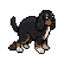

<div align="center">



# Jumbini

**A dog who actually lives on your Mac.**

Jumba walks along the tops of your open windows. He gets the zoomies when your Mac runs
hot, and goes to sleep when you walk away from it. He is a real dog — a tricolor spaniel
mix — and every frame of him was drawn by hand from photographs.

He sits above every window and clicks straight through, so he never gets in the way of the
app you are actually using. No account, no network, no permissions, no AI. Free, and the
code is open.

[Download the latest release](https://github.com/abjumb/jumbini/releases/latest) ·
[What he does](#meet-jumba) · [How it works](#architecture)

</div>

---

## Three things that make him different

**He walks on your windows.** Not the edge of the screen — your actual windows. He picks
one, walks over, hops onto the title bar, patrols it, leans over the edge to look down,
and rides along if you move the window gently. Drag it hard enough and he falls off, which
is the joke. Most desktop pets pace along the bottom of the display; the ones that climb
are Java, or Windows-only, or both.

**He knows what your Mac is doing.** The machine gets hot and he gets the zoomies. Your
battery goes low and he whines and lies down. Your build finishes and he celebrates. You
step away for two minutes and he curls up; you come back and he wakes up. He never tells
you any of this —
there is no dashboard, no notification, no status bar. There is just a dog behaving oddly,
and a second later you work out why. Every reading is ambient: nothing he watches requires
a permission prompt, and a source that can't be read on your machine switches itself off
permanently rather than nagging you.

**He is one real dog, and the art is not generated.** 334 hand-drawn sprites across two
coats — eight rotations for every state, drawn from photographs of an actual dog named
Jumba. There is no catalog of ninety interchangeable pets, no marketplace, no "pick your
character" screen. There is one dog. That is the entire point.

---

## Install

**Requirements:** macOS 14 (Sonoma) or newer, Apple Silicon.

1. Grab `Jumbini.dmg` from the [latest release](https://github.com/abjumb/jumbini/releases/latest).
2. Open the DMG and drag **Jumbini** to Applications.
3. Open it.

That is the whole thing. Jumbini is signed with a Developer ID certificate and notarized by
Apple, so it opens on first launch like any other app — no right-click trick, no trip
through Privacy & Security, no "Jumbini is damaged and can't be opened."

Jumbini has no Dock icon and no window. When it is running you get a dog on screen and a
small pixel-dog icon in your menu bar. Everything else lives in that menu.

## Meet Jumba

He runs his own life. Every few seconds of standing around, he rolls the dice and picks
something to do:

| What he does | How likely | How long |
|---|---|---|
| Wander somewhere new | 40% | until he arrives |
| Nap (in his bed if he has one) | 15% | 10-20s |
| Sniff your cursor around the screen | 12% | 100-140s |
| Spin in place, for no reason | 10% | 0.9s |
| Zoomies | 8% | 10s |
| Hunch over and do his business | 6% | 2.5s |
| Climb onto one of your windows | 5% | 18-36s |
| Bark at nothing in particular | 4% | 1.2s |

The sniffing one is the sleeper hit: he trots toward wherever your pointer is, and once he
is within about 60 points he switches to the nose-down sniff pose and keeps tracking it.
Six times out of ten a finished sniff escalates — he drops into a stalk, freezes, and
pounces on your cursor. Zoomies means bouncing off the edges of your screen at 900 points
per second with his fur rabbit in his mouth.

The piles he leaves behind stay where he left them, up to five at a time — a sixth makes
the oldest fade away. Give one two minutes and it dries out, goes pale, and attracts a
couple of flies.

## He walks on your windows

Climbing is close to the rarest thing he does on purpose — 5%, second only to barking at
nothing — because it should feel like catching him at it rather than watching a routine.

He looks for a window within about 700 points whose top edge is a climb of no more than
420 points, walks to it, and hops up. Once he is up there he patrols the title bar,
stopping at each end to put his nose over the edge and look down at whatever is underneath.

Move that window and he rides it. Move it faster than about 180 points between two polls
and the drag shakes him off — he falls, accelerating at 2000 points per second squared up
to a terminal velocity that keeps him reading as a dog and not a meteor, and lands with a
squash. He gets up and carries on.

If you have no windows open, none of this happens and he never mentions it.

## He knows what your Mac is doing

Five ambient sources. Four are polled every five seconds — idle time, battery, build
tools, Focus — and each of those switches itself off permanently if it can't be read on
your machine. Thermal state arrives as a notification instead.

| What he notices | How he takes it |
|---|---|
| A build tool finishes a real build | Celebration — a yip, hearts, confetti |
| The machine gets thermally stressed | Zoomies. He is not helping |
| Battery drops low while unplugged | He whines and lies down |
| No input for two minutes | He goes to sleep |
| Input comes back | He wakes up |

Each of these puts a small thought bubble over his head — a flame, a battery, a party hat —
so that a dog who suddenly loses his mind reads as a joke rather than a bug.

Two deliberate restraints. A build has to run continuously for a while before its exit
counts, and two celebrations can never land close together, so a rebuild storm gets one
party rather than forty. And Do Not Disturb detection is best-effort: Focus has no public
API, the private database is protected, and without Full Disk Access the very first read
fails and that source switches itself off for good. That is the expected outcome, not a
bug. Jumbini will never ask you for Full Disk Access.

## Controls

Everything is mouse-driven, directly on the dog and his stuff.

### The dog

| Do this | Get this |
|---|---|
| Left-click him | Pet him. Hearts float up, then he settles back down |
| Click and drag him | Pick him up. He dangles from the cursor until you let go |
| Hover over him a while | He takes it personally and barks at you |
| Right-click him | Commands, Tricks, Toys, Wardrobe, Coat |

The command list is Sit, Lie Down, Spin, Spin Forever, Zoomies!, and Fetch. Catch him
mid-spin and the first item becomes **Stop Spinning**.

### Fetch

1. Right-click him → **Fetch**. He sits and waits.
2. **Left-click anywhere on screen.** The ball arcs to that spot.
3. He sprints after it, picks it up, carries it back to where he was standing, drops it,
   and does a little happy flourish about it.

Changed your mind? Right-click anywhere while he is waiting and the fetch is off. He also
gives up on his own after 10 seconds.

### Toys

Fetch is the ball. The toy box is the rest, and each one plays differently.

| Toy | How it plays |
|---|---|
| **Frisbee** | Aimed and thrown. It floats — a long flat arc with real hang time, which is what makes the mid-air catch possible |
| **Squeaky Toy** | Lobbed nearby. He grabs it and shakes it to death |
| **Tug Rope** | Grab the free end and pull. The rope re-lays itself every frame between two moving points |

Tug is a genuine contest with a coin-flip ending: he is a small dog with a lot of
conviction.

### Tricks

Four tricks — Shake, High Five, Play Dead, Roll Over — and he does not know any of them
yet.

Asking for a locked trick is an attempt. Give him a treat within ten seconds and the
attempt counts as a rep. Three reps and the trick is his permanently, saved between
launches. The menu shows you where you are: **Teach Shake (1/3)**.

Once a trick is learned, performing it is just showing off, and showing off is not
training. Nothing further accumulates.

### The treat box (bottom-right)

| Do this | Get this |
|---|---|
| Click the box | Take a treat — the box rocks, and the treat rides your cursor |
| Click again anywhere | Drop the treat. He drops everything and sprints for it |
| Drop it back on the box | Put it away, no harm done |
| Drag the box | Move the box (hold ⌥ to start the drag instantly) |

Treats outrank everything: naps, fetch, tricks, commands, all of it. He eats it, gets
hearts, and then, about a second later, hunches over. Treats go straight through him.

Only one treat exists at a time. Drop a second one and he switches targets. Interrupt him
mid-chase with a command and the abandoned treat quietly vanishes.

### The bed (bottom-right)

| Do this | Get this |
|---|---|
| Drag it | Move the bed. If he was already walking to it, he re-routes mid-stride |
| Right-click it | Pick from 12 beds (plus the built-in fuzzy one) |

Bed choice sticks between launches. **Lie Down** and naps both send him to the bed if he
has one, and he settles into the cushion rather than standing on it.

### Wardrobe and coat

Right-click him → **Wardrobe** for a Party Hat, Top Hat, Cowboy Hat, Beanie, Bandana,
Sunglasses, or a Raincoat. One at a time, and remembered between launches. Each piece is
drawn facing south, south-east, east and north-east; the app mirrors those for the western
half and reuses the north-east art for north.

Right-click him → **Coat** to switch between **Classic** and **Shaggy**. Same dog, second
haircut, a full 8-directional sprite set each.

### Jumbini Cam

**⌥⇧J**, or **Jumbini Cam** in the menu bar. It copies him — whatever he happens to be
doing at that moment — straight to your clipboard as a PNG on a transparent background,
with a little caption plate underneath reading **Jumbini, 3:42 PM** and a paw watermark in
the corner.

Paste it into Slack. That is the whole feature.

### Menu bar

- **Hunger: ██████████ 100%** — a bottomless dog. This meter has never moved and never
  will. It is the joke.
- **Treats eaten: N (no effect)** — counts up forever, does nothing, see above.
- **Jumbini Cam** (⌥⇧J) — see above.
- **Mute Sounds** — he barks (three different takes), growls, whines, yips, squeaks and
  grunts. Sometimes you are in a meeting.
- **Pause** — hides the overlay and freezes the scene. Click **Resume** to bring him back.
- **Leave Jumbini Behind** (⌘Q) — quit.

## What he doesn't do

Worth stating plainly, because a lot of things in this category do:

- **No network.** He never phones home. There is nothing to phone home to.
- **No account, no login, no telemetry, no analytics.**
- **No permissions.** No Accessibility, no Screen Recording, no Full Disk Access, no
  Input Monitoring. He reads window geometry, idle time, battery and thermal state through
  public APIs that require no prompt, and reads nothing else.
- **No AI.** No model, no API key, no chat. He is a state machine with 29 states and a
  dice roll, and he does not have anything to say to you.
- **No purchases, no cosmetic packs, no subscription, no ads.**

What he *is*: signed with a Developer ID certificate and notarized by Apple, which is how
your Mac knows the build you downloaded is the one that left this repository. The pipeline
that does it is [SIGNING.md](SIGNING.md), and it runs on every tagged release.

<!-- TODO: measure and publish idle CPU %, resident memory, and battery impact on an
     M-series Mac. Resource cost is the top complaint driver in this category and the
     number is worth more on this page than any feature. -->

## Build from source

No Xcode needed. Command Line Tools and Swift 6 are enough.

```bash
git clone https://github.com/abjumb/jumbini.git
cd jumbini
./Scripts/bundle.sh          # → build/Jumbini.app
open build/Jumbini.app
```

`bundle.sh` does a release build, assembles the `.app` around it with `Scripts/Info.plist`
and the icon, copies in the SwiftPM resource bundle (all the sprites), and ad-hoc signs
the result.

Other scripts:

```bash
./Scripts/test.sh            # run the test suite (327 tests)
./Scripts/dmg.sh             # → build/Jumbini.dmg, drag-to-Applications layout
```

While iterating, the relaunch loop is:

```bash
pkill -x Jumbini; ./Scripts/bundle.sh && open build/Jumbini.app && pgrep -x Jumbini
```

### Run the tests

```bash
./Scripts/test.sh
```

Use the script, not bare `swift test`. Swift Testing under Command Line Tools needs an
explicit macro plugin path and two rpaths into `/Library/Developer/CommandLineTools`, and
the script bakes those flags in. Extra arguments pass straight through
(`./Scripts/test.sh --filter zoomies`).

## Architecture

The whole design is one split: **decisions live in a pure state machine, rendering lives in
SpriteKit, and they talk in values.**

```
                  events                    effects
   PetScene  ───────────────►  DogBrain  ───────────────►  PetScene
  (SpriteKit)  .tick             (pure)      .play(.run)     (SpriteKit)
               .petted                       .moveTo(p, 90)
               .system(.fansUp)              .startZoomies
               .arrived                      .hopTo(p)
```

`DogBrain` imports Foundation and CoreGraphics, nothing else. Every frame the scene feeds
it an event plus a timestamp, and it hands back a list of `DogEffect` values for the scene
to apply. It never touches a node, a texture, or a clock.

That buys determinism. The brain's randomness comes from an injected
`RandomNumberGenerator` (a SplitMix64 seeded per test) and its timing comes from
timestamps the caller passes in, so a test can wind the clock forward and assert on exact
state transitions with zero flake and zero sleeping. The brain tests build one with
`makeBrain(seed:tune:)`, zero out every autonomy probability, enable exactly one, and
check what happens.

The same discipline extends outward. `TrickTrainer` takes an injected store and explicit
timestamps. `SystemMonitor` splits every source into a pure transition struct and a thin
sampling shell, so "does a hot machine emit exactly one `fansUp`" is a unit test with no
Mac underneath it. `WindowSurfaces` keeps the coordinate conversion pure and testable,
because two coordinate systems meet in that file and confusing them is the classic way to
end up with a dog walking on the ceiling.

### Files

| File | Lines | What lives there |
|---|---|---|
| `Sources/Jumbini/DogBrain.swift` | 1428 | The state machine. 29 states, 16 events, 28 effects, every tuning knob |
| `Sources/Jumbini/PetScene.swift` | 2443 | Applies effects, owns all mouse input, zoomies physics, cursor-sniff stepping, wardrobe, click-through |
| `Sources/Jumbini/SpriteLoader.swift` | 437 | `Facing` (8 directions) and `SpriteLibrary` (coat resolution, texture cache, nearest-neighbor, strip-sheet slicing) |
| `Sources/Jumbini/SystemMonitor.swift` | 373 | Idle, battery, thermal, build and Focus tracking. Pure transition logic, thin sampling shell |
| `Sources/Jumbini/WindowSurfaces.swift` | 349 | Reads `CGWindowList`, converts to scene coordinates, hands the brain a list of walkable surfaces |
| `Sources/Jumbini/AppDelegate.swift` | 284 | Menu bar item, Jumbini Cam and its hotkey, pause, mute, hunger gag, display changes |
| `Sources/Jumbini/Dog.swift` | 225 | The dog sprite: plays animations in whichever of 8 directions he faces, walks to targets, reports arrival |
| `Sources/Jumbini/ScreenLayout.swift` | 197 | Multi-display bounds, and the holes in them that an uneven monitor arrangement leaves behind |
| `Sources/Jumbini/CoatCatalog.swift` | 146 | `Coat` and the catalog of installed ones: which folders on disk qualify, their manifests, where each coat's sprites resolve |
| `Sources/Jumbini/TugRope.swift` | 132 | Knotted caps and tiling middles, re-laid every frame between two moving points |
| `Sources/Jumbini/TrickTrainer.swift` | 127 | Trick reps, the reward window, and what persists |
| `Sources/Jumbini/Frisbee.swift` | 100 | The disc: a long, flat, slow arc with real hang time |
| `Sources/Jumbini/Ball.swift` | 71 | Tennis ball: throw arc, bounce, landing callback |
| `Sources/Jumbini/EmoteBubble.swift` | 71 | The thought bubble. Deliberately ignorant of why it was asked for |
| `Sources/Jumbini/OverlayWindow.swift` | 46 | Borderless non-activating `NSPanel` at status-bar level, click-through by default |
| `Tests/JumbiniTests/` | 3931 | 327 deterministic tests across brain, tricks, system signals, window surfaces, screen layout and coat resolution |

### Two details worth knowing

**Click-through is recomputed every frame.** The overlay window sets
`ignoresMouseEvents = true` almost always, so your clicks land in your real apps. Once per
frame `PetScene` checks whether the cursor is over the dog, the treat box, the bed, a pile
or the free end of the tug rope (or a drag or an armed throw is in flight) and flips the
flag. That is why he never eats a click you meant for Xcode.

**The window never takes focus.** It is a `nonactivatingPanel` that refuses to become key
or main, so petting the dog does not steal your cursor out of the editor you are typing
in. It also joins all Spaces and floats over full-screen apps.

## The art

Jumba is a real dog. The pixel art is of him, drawn by hand from photographs — not
generated, not licensed, not bought from a sprite pack.

Each coat is 8 rotations for each of twenty states — `idle`, `run1`, `run2`, `sit`,
`sleep`, `sniff`, `hunch`, `stalk`, `pounce`, `paw`, `highfive`, `playdead`, `peek`,
`fall`, `land`, `growl`, `whine` and the rest — including a directional `bark`. It lives in
`Sources/Jumbini/Resources/jumba/` as `<state>_<direction>.png`, with the shaggy coat
prefixed. The old 6-frame east-facing bark strip is still in there as a fallback, and
`rollOver` and `shakeToy` currently borrow other poses because nobody has drawn them yet.

```bash
python3 Tools/import_jumba.py /path/to/export
```

`import_jumba.py` takes export folders shaped like `<state>/rotations/<direction>.png`,
strips the baked-in white background with a border flood fill (the dark outline protects
interior whites like his chest blaze and socks), and flattens everything into the resource
folder. Pure stdlib, including a hand-rolled PNG codec, no dependencies. New states get
registered in the `KIT_STATES` / `KIT_SHAGGY_STATES` maps, which are the authoritative
ones; the older `EXTRA_STATES` map above them only still exists so the pre-kit exports
keep importing.

Most props are drawings too. `jumbini-kit/sprites/` and `jumbini-kit/treat-box/` are the
durable source copies of Alex's prop and FX art; the importer copies the files the app
loads into `Resources/sprites/`:

```bash
python3 Tools/import_kit_props.py
```

It renames the treat box's frames into the `name_<n>` convention
`SpriteLibrary.propSequence` reads, and clears the editor backdrop that got flattened into
a couple of frames. Its `IMPORT` list is explicit — a new file in the kit doesn't reach the
bundle until it's listed there, which is also where the notes live on which delivered
frames were unusable and why.

What is left over (ball, heart, bed, treat, rabbit) is generated code, not drawings:

```bash
python3 Tools/make_sprites.py
```

Run it without `--all`. That flag also regenerates procedural placeholder art for the dog
himself, which nothing uses anymore.

### Drawing your own dog

Jumba is the dog this app is about, and he is what you get when you install it. But the
app can also load dog art from a folder instead of from the bundle, so if you draw, you
can put your own dog on the desktop without touching the source. Drop a folder of sprites
into `~/Library/Application Support/Jumbini/coats/` and it appears in the **Coat** menu
alongside Classic and Shaggy; pick **Classic** to get Jumba back, in one click.

[COATS.md](COATS.md) is the format: filenames, the 17 states the app reads, the eight
directions, canvas and outline expectations, and the optional `coat.json` for per-state
scale. It is written to be followed without reading any source.

The app only ever reads PNGs off a disk. It does not generate art and makes no network
calls to load a coat — how the sprites got drawn is entirely your business.

## Project layout

```
Sources/Jumbini/           app code
  Resources/jumba/         hand-made dog sprites, 8 directions per state, two coats
  Resources/sprites/       props, emote icons, 12 bed variants, wardrobe
  Resources/audio/         3 barks, growl, whine, yip, squeak, grunt, chime, shutter
  Resources/Icons/         menu bar icon (16 and 32 px)
Tests/JumbiniTests/        327 deterministic tests
Tools/                     import_jumba.py, import_kit_art.py, import_kit_props.py, make_sprites.py
Scripts/                   test.sh, bundle.sh, dmg.sh, Info.plist
icon/                      app icon sources and iconsets
```

## Contributing

One rule that matters: **behavior changes are test-first.** Anything that touches how Jumba
decides what to do starts with a failing test in `DogBrainTests.swift`, then the
implementation. The brain is pure and deterministic specifically so this is cheap. The
same goes for `TrickTrainer`, `SystemMonitor`, `WindowSurfaces` and `ScreenLayout` — the
pure half of each is where the test goes.

Rendering and input code in `PetScene` has no tests. Verify those by hand: rebundle,
relaunch, and actually play with the dog.

Adding a case to `DogEffect` breaks `PetScene`'s exhaustive switch, which is intentional.
Stub the new case so the package compiles, then wire it up for real.

## Known limitations

- **Apple Silicon only.** A universal binary would need `--arch` work in `bundle.sh`.
- **Do Not Disturb detection usually doesn't work**, by design — see above.

## License

Code is MIT. See [LICENSE](LICENSE).

The artwork is not. Jumba is a real dog, the pixel art is of him, and it stays his:
everything under `Resources/jumba/` and `jumbini-kit/`, the bed and wardrobe variants, the
icons, the art export folders, and the reference photo are all rights reserved. The
generated props (ball, heart, treat, rabbit, and the built-in bed) come out of
`Tools/make_sprites.py` and are MIT like the rest of the code.

Fork it, build it, reuse the code. If you ship something derived from it, replace the dog.
